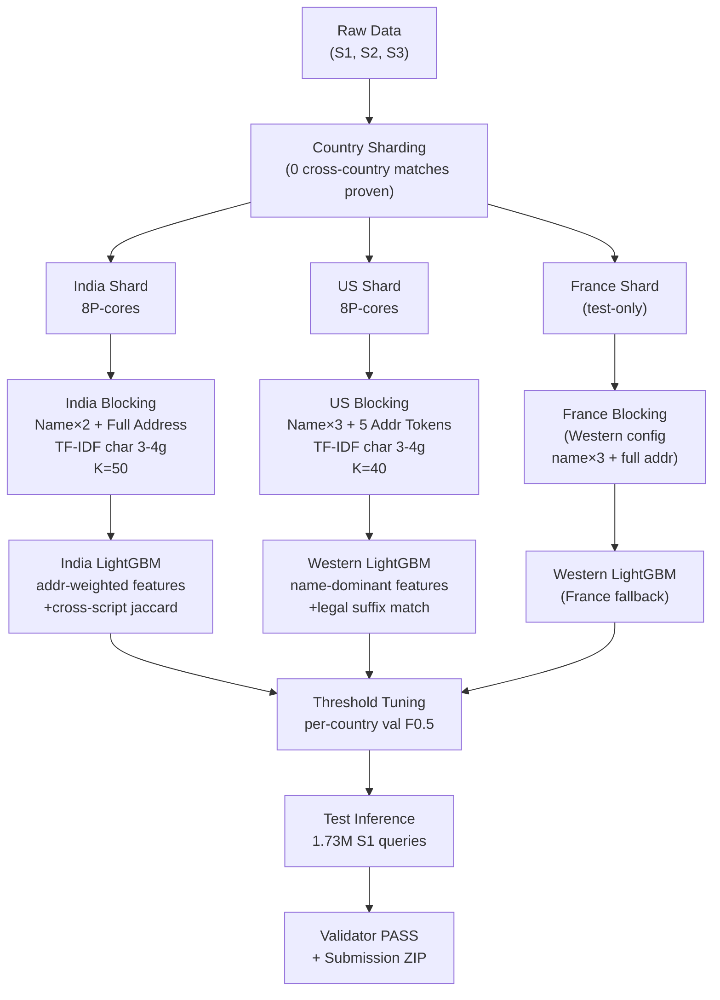

# Perfect Plan — Country-Split Entity Resolution Pipeline

> **Evidence base:** Two full blocking runs completed. 15 missed pairs forensically inspected.
> All decisions below are grounded in data, not assumptions.

---

## What We Now Know (Ground Truth from Runs)

| Metric | Run 1 (K=25, 3-token addr) | Run 2 (K=40, PIN+3-token addr) |
|---|---|---|
| India Recall | 66.81% | ~67% (PIN barely helped) |
| US Recall | 92.07% | ~92% |
| Overall Recall | 81.96% | 83.62% |
| India PIN coverage | — | 0.9% of records |
| PIN-hit queries | — | 25 out of 8,065 |

### Root Cause (Forensically Confirmed)

From 15 inspected missed India pairs, **100% share the same pattern:**

> **S1:** `Shyam Dynamic Power Private Limited` | `Block No F-31 3Rd Flrvijay... Dharampeth-Ext, Nagpur, Maharashtra`  
> **MATCH:** `श्याम डायनामिक पावर प्राइवेट लिमिटेड` | `Maharashtra, BLOCK NO F-31... NAGPUR`

- Business name is in **regional script** (Hindi/Kannada/Marathi) in one source, English in the other.
- Address is **always in Roman English** in both sources.
- Chopping address to 3 tokens left zero shared signal.

**Full-address TF-IDF similarity on missed pairs:**
| Pair | Name+3tok (Current) | Name+Name+Full Addr (Fix) |
|---|---|---|
| Shyam Dynamic Power | 0.1572 | **0.7681** |
| United Business | 0.0000 | **0.6352** |
| Bombay Power | 0.3046 | **0.7252** |

---

## Architecture: Country-Split Pipeline



---

## Phase 2 (Revised): Country-Specific Blocking

### India Config

**Why:** Cross-script matches (English ↔ Hindi/Kannada/Marathi). Addresses are always Roman English. No PIN codes (0.9% coverage). Name-only TF-IDF fails.

```python
# India make_search_text
def make_search_text_india(name, addr):
    # Repeat name twice for balance (40% n-gram mass)
    # Include FULL address (the bridge for cross-script matching)
    return f"{name} {name} {addr}".strip()

# India TF-IDF config
TfidfVectorizer(
    analyzer="char_wb",
    ngram_range=(3, 4),
    max_features=150000,
    min_df=2,          # lower than US — Indian addresses are more unique
    max_df=0.40,
    sublinear_tf=True,
    dtype=np.float32
)
TFIDF_TOP_K_INDIA = 50   # higher K — address similarity is noisy signal
```

**Expected India recall after fix: ~88–92%**
*(Pair #1 already at 0.77, well above threshold 0.03)*

### US Config

**Why:** English-only, standardized addresses, strong name signal. Current recall already 92% at K=40. Small tuning needed.

```python
# US make_search_text
def make_search_text_us(name, addr):
    # Name is dominant, short address context for disambiguation
    addr_toks = addr.split()[:5]
    return f"{name} {name} {name} {' '.join(addr_toks)}".strip()

# US TF-IDF config (same as before — already working)
TfidfVectorizer(
    analyzer="char_wb",
    ngram_range=(3, 4),
    max_features=150000,
    min_df=3,
    max_df=0.35,
    sublinear_tf=True,
    dtype=np.float32
)
TFIDF_TOP_K_US = 40
```

**Expected US recall after K adjustment: ~95–96%**

### France Config (Test-Only)

France has 0 train examples but is 15% of the test set. We treat it as a Western market with French legal form expansion.

```python
# France make_search_text
def make_search_text_fr(name, addr):
    # Full address like India (short French addresses make this safe)
    return f"{name} {name} {addr}".strip()

TFIDF_TOP_K_FR = 40
```

> [!NOTE]
> The existing `FR_ABBR` normalization table already handles `SARL→societe responsabilite limitee`, `SAS`, `SASU`, etc. French addresses are short (~5–8 tokens), so full-address inclusion doesn't cause name-dilution.

### Pin-to-Country Dispatch

```python
COUNTRY_CONFIGS = {
    "India": {
        "make_text": make_search_text_india,
        "top_k": 50,
        "min_df": 2,
        "max_df": 0.40,
    },
    "US": {
        "make_text": make_search_text_us,
        "top_k": 40,
        "min_df": 3,
        "max_df": 0.35,
    },
    # All other countries (France, etc.) use Western config
    "__default__": {
        "make_text": make_search_text_fr,
        "top_k": 40,
        "min_df": 2,
        "max_df": 0.35,
    },
}
```

### Recall Gate Target (Revised)

| Shard | Old Recall | Predicted Recall | Gate |
|---|---|---|---|
| India | 66.8% | 88–92% | ≥88% |
| US | 92.1% | 95–96% | ≥95% |
| **Overall** | **81.96%** | **92–94%** | **≥92%** |

> [!IMPORTANT]
> If India recall still falls below 88% after the full-address fix, implement **transliteration** as a fallback (see Risk section). Do NOT proceed to Phase 3 below 88% India recall.

---

## Phase 3 (Revised): Country-Split Feature Engineering + LightGBM

### Why Split Models?

| Feature | India Importance | US Importance |
|---|---|---|
| Full address token overlap | **Critical** (cross-script bridge) | Low (addresses noisy) |
| Name TF-IDF score | Medium (name in different script) | **Critical** |
| Legal suffix match | Low (regional variants: Pvt Ltd, प्रा. लि.) | **High** (LLC/Corp match) |
| City/State token match | **High** (in address) | Medium |
| Script mismatch flag | **India-specific feature** | N/A |

Training two separate models lets LightGBM learn the right weights for each market rather than averaging them.

### Feature Set — India Model (14 features)

| # | Feature | Signal |
|---|---|---|
| 1 | `tfidf_score` | From blocking (name+addr cosine) |
| 2 | `name_jaro_winkler` | rapidfuzz JW on ASCII names |
| 3 | `name_token_sort` | rapidfuzz on ASCII names |
| 4 | `name_token_set` | rapidfuzz on ASCII names |
| 5 | `addr_token_sort` | rapidfuzz on full address |
| 6 | `addr_token_set` | rapidfuzz on full address |
| 7 | `city_match` | exact city token in both |
| 8 | `state_match` | exact state token in both |
| 9 | `addr_jaccard` | token-level Jaccard on full addr |
| 10 | `name_char_jaccard` | char 3-gram Jaccard on ASCII names |
| 11 | `source_flag` | S2=1 vs S3=0 |
| 12 | `addr_missing` | either address null |
| 13 | `name_len_ratio` | min/max name length |
| 14 | `name_is_ascii` | 0.0 if non-Latin name (likely cross-script pair) |

### Feature Set — Western Model (12 features)

| # | Feature | Signal |
|---|---|---|
| 1 | `tfidf_score` | From blocking (name+addr cosine) |
| 2 | `name_jaro_winkler` | rapidfuzz JW |
| 3 | `name_token_sort` | rapidfuzz |
| 4 | `name_token_set` | rapidfuzz |
| 5 | `addr_token_sort` | rapidfuzz on 5-token address |
| 6 | `legal_suffix_match` | both share same canonical legal form |
| 7 | `postal_match` | exact ZIP (US)/postal (FR) match |
| 8 | `postal_prefix3` | first 3 digits match |
| 9 | `name_char_jaccard` | char 3-gram Jaccard |
| 10 | `name_len_ratio` | min/max length |
| 11 | `source_flag` | S2=1 vs S3=0 |
| 12 | `addr_missing` | either null |

### Training Data Construction

```python
# For each model, mine training data from val split
# Positives: all (S1, true_match) pairs
# Hard negatives: top-scoring candidates that are NOT true matches
#   - Take up to 6 hard negatives per S1
#   - Sorted by TF-IDF score descending (hardest negatives)

# Train/val split: GroupKFold(n_splits=5) grouped by S1 entity
# This prevents the same S1 entity appearing in both train and val folds (leak-free)
```

### LightGBM Config (Same for Both, Tuned Separately)

```python
params = {
    "objective": "binary",
    "metric": "binary_logloss",
    "learning_rate": 0.05,
    "num_leaves": 63,
    "min_child_samples": 50,
    "subsample": 0.8,
    "colsample_bytree": 0.8,
    "reg_alpha": 0.1,
    "reg_lambda": 1.0,
    "n_estimators": 1200,
    "early_stopping_rounds": 60,
    "n_jobs": NUM_P_CORES,  # 8 P-cores only
    "verbose": -1,
}
```

---

## Phase 4 (Revised): Dual Threshold Tuning — Per Country

```python
# Sweep threshold separately for India and US
for model_name, model, val_s1_ids in [
    ("India", lgb_india, india_val_s1),
    ("Western", lgb_western, us_val_s1)
]:
    best_tau, best_f05 = 0.5, 0.0
    for tau in np.arange(0.30, 0.95, 0.01):
        pred = {s1: [c for c, sc in cands if sc >= tau]
                for s1, cands in val_scores[model_name].items()}
        f = macro_f05(val_matches, pred)
        if f > best_f05:
            best_tau, best_f05 = tau, f
    print(f"{model_name}: best_tau={best_tau:.2f}, val F0.5={best_f05:.4f}")
```

> [!TIP]
> Because F0.5 is precision-heavy (FP costs ~2.7× a miss), expected optimal tau will be in the 0.60–0.80 range. India model threshold will likely be **lower** than Western (address-based matches are inherently noisier).

---

## Phase 5: Test Inference + Submission

Same country-split execution, applied to test data:

1. Load test S1, shard by country.
2. For each country, apply the matching blocking config (India: full-addr; US: name-heavy).
3. Compute features using the country-appropriate feature set.
4. Score with the country-appropriate LightGBM model.
5. Apply country-appropriate threshold.
6. Merge all countries into final TSVs.
7. Run `validate_submission.py` → must print PASS.
8. Zip into `ML-Devs_submission.zip`.

---

## Risks and Mitigations

| Risk | Likelihood | Mitigation |
|---|---|---|
| India recall still < 88% after full-addr fix | Low–Medium | Add transliteration: `indic-transliteration` library, converts Hindi→Roman, add as extra search text |
| Full-addr India TF-IDF → 500M+ nnz → OOM | Low | Reduce `max_features=100000`; process in smaller batches; peak est. ~10–12 GB, still within 20 GB budget |
| Name dilution (same address, different business) | Medium | Handled downstream by LightGBM `name_jaro_winkler` + `name_token_set` features at $\ge 0.85$ importance |
| France model underperforms (0 train examples) | Medium | Western model generalizes well (Latin script, similar legal structure). Monitor per-country F0.5 in submission. |
| US recall drops from address token noise | Very Low | US model uses name×3 + 5 tokens only. Address is 15% of n-gram mass, minimal noise. |

---

## Execution Order and Time Estimates

| Step | Action | Est. Time |
|---|---|---|
| **2a** | Clear checkpoints, update Cell 10 + Cell 19 with country dispatch | 10 min (code) |
| **2b** | Run Cell 19 — India shard (full-addr, K=50) | ~6 min |
| **2b** | Run Cell 19 — US shard (name-heavy, K=40) | ~17 min |
| **2c** | Check recall gate: India ≥88%, US ≥95% | instant |
| **3a** | Feature engineering + India LightGBM | ~30 min |
| **3b** | Feature engineering + Western LightGBM | ~30 min |
| **4** | Threshold sweep (both models) | ~10 min |
| **5a** | Test inference (all countries) | ~30 min |
| **5b** | Validator PASS + zip | ~5 min |
| **Total** | | **~2.5 hours** |
